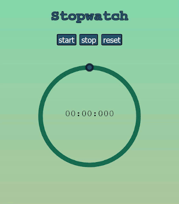

# Stopwatch

Stopwatch application built in vanilla HTML, CSS, JS as a practice project.

I had the chance to fiddle with svg animations in particular.

## The stopwatch

## Try it!

* Download this repository;
* Open the 'stopwatch.html' file in your browser;
* Start measuring time.